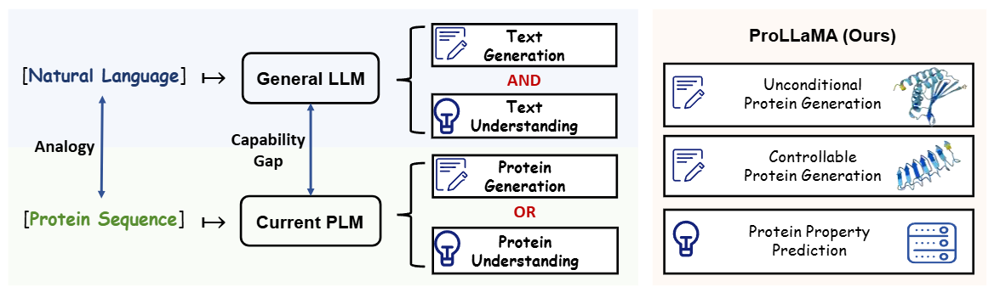
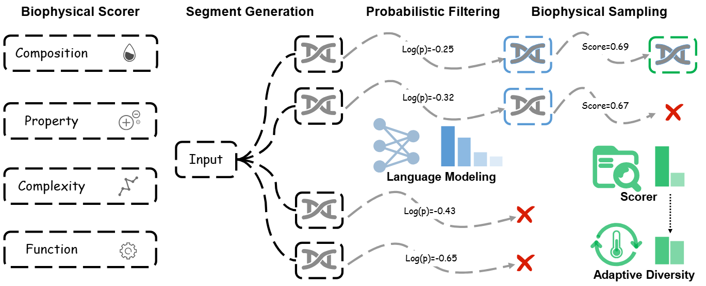
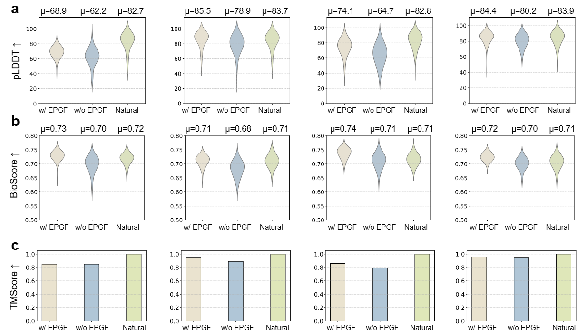
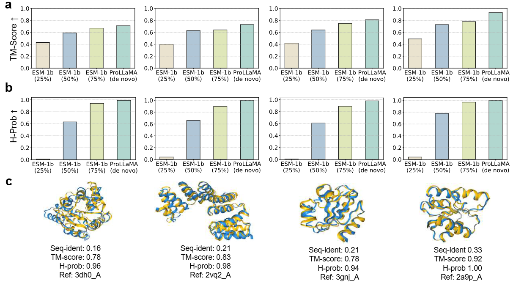

<h2 align="center"> <a href="hhttps://arxiv.org/abs/2402.16445">ProLLaMA: A Protein Language Model for Multi-Task Protein Language Processing</a></h2>
<h5 align="center">
    
[](https://ieeexplore.ieee.org/abstract/document/10979347)
[](https://huggingface.co/GreatCaptainNemo/ProLLaMA_Stage_1)
[](https://huggingface.co/GreatCaptainNemo/ProLLaMA)
[](https://huggingface.co/datasets/GreatCaptainNemo/instruction_dataset)
<!-- [](https://github.com/Lyu6PosHao/ProLLaMA/blob/main/LICENSE) --> <br>

</h5>

## 📣 News
* [2025/04] Accepted by *IEEE Transactions on Artificial Intelligence*. [Paper](https://ieeexplore.ieee.org/abstract/document/10979347) and [EPGF](https://github.com/PKU-YuanGroup/ProLLaMA/blob/main/scripts/EPGF.py) (a test-time computation framwork which ensures that generated proteins are not only statistically coherent but also biologically viable)
* [2025/01/07] Update some training codes for easier usage. Details in [Logs](https://github.com/PKU-YuanGroup/ProLLaMA?tab=readme-ov-file#logs).
* [2025/01/01] We propose [HME](https://github.com/Lyu6PosHao/HME), a multimodal multitask Chemical LLMs.
* [2024/07/17] Update a new version of the paper.
* [2024/06/27] Release the codes for pretraining (Stage1) and instruction_tuning (Stage2). See [Quick Train](https://github.com/PKU-YuanGroup/ProLLaMA?tab=readme-ov-file#%EF%B8%8Fquick-train).
* [2024/06/08] Opensource the instruction dataset on [HuggingFace](https://huggingface.co/datasets/GreatCaptainNemo/instruction_dataset)
* [2024/04/25] Upload ProLLaMA_Stage_1 to [HuggingFace](https://huggingface.co/GreatCaptainNemo/ProLLaMA_Stage_1). More information is in [Others](https://github.com/PKU-YuanGroup/ProLLaMA?tab=readme-ov-file#%EF%B8%8Fothers).
* [2024/04/10] Add a script (in /scripts/mutation.py) to meature mutation effects.
* [2024/02.29] Update the /scripts/infer.py to fix bugs.


## 🗝️ Abstract
Recent advances in Protein Language Models (PLMs) have transformed protein engineering, yet unlike their counterparts in Natural Language Processing (NLP), current PLMs exhibit a fundamental limitation: they excel in either Protein Language Understanding (PLU) or Protein Language Generation (PLG), but rarely both. This fragmentation hinders progress in protein engineering. To bridge this gap, **we introduce ProLLaMA, a multitask protein language model enhanced by the Evolutionary Protein Generation Framework (EPGF)**. We construct** a comprehensive instruction dataset containing approximately 13 million samples with over 11,000 superfamily annotations** to facilitate better modeling of sequence-function landscapes. We leverage a two-stage training approach to develop **ProLLaMA, a multitask LLM with protein domain expertise**. **Our EPGF addresses the mismatch between statistic language modeling and biological constraints through three innovations**: a multi-dimensional interpretable scorer, hierarchical efficient decoding, and a probabilistic-biophysical joint selection mechanism. Extensive experiments demonstrate that ProLLaMA excels in both unconditional and controllable protein generation tasks, achieving superior structural quality metrics compared to existing PLMs. Additionally, ProLLaMA demonstrates strong understanding capabilities with a 67.1% exact match rate in superfamily prediction. EPGF significantly enhances the biological viability of generated sequences, as evidenced by improved biophysical scores (+4.3%) and structural metrics (+14.5%).

<p align="center"></p>

<details open><summary> **I also have other AI for Science projects that may interest you.** </summary><p>
<!--  may -->

> [TaxDiff: Taxonomic-Guided Diffusion Model for Protein Sequence Generation](https://arxiv.org/abs/2402.17156) [](https://github.com/PKU-YuanGroup/TaxDiff) <br><br>
> [Navigating Chemical-Linguistic Sharing Space with Heterogeneous Molecular Encoding](https://arxiv.org/abs/2412.20888) [](https://github.com/Lyu6PosHao/HME) <br><br>
> DM-Assembler: Leveraging Domain Motif Assembler for Multi-objective, Multi-domain and Explainable Molecular Design [](https://github.com/cziun/DM-Assembler) <br><br>

</p ></details>

## 💡Highlights
### Powerful model
* Our ProLLaMA is the first model to our knowledge capable of simultaneously handling multiple PLP tasks, including generating proteins with specified functions based on the user's intent.

### Large-scale Dataset
* We construct a comprehensive instruction dataset containing approximately 13 million samples with superfamily annotations.

### General training framework
* We propose a training framework with scalability and efficiency that enables any general LLM to be trained as a proficient model for multiple tasks in Protein Language Processing.

### Evolutionary Protein Generation Framework (EPGF)
* EPGF is a test-time computation framwork, which ensures that generated protein sequences are not only statistically coherent but also biologically viable, addressing a critical limitation in current PLMs.

## 😮Main Results
* The Overview of Evolutionary Protein Generation Framework (EPGF) [code](https://github.com/PKU-YuanGroup/ProLLaMA/blob/main/scripts/EPGF.py)
  <p align="center"></p>
  
* ProLLaMA generates better protein sequences with EPGF. "Natural" denotes natural proteins.
  <p align="center"></p>
  
* The performance of ProLLaMA in Conditional Protein Generation. (controlled by the given [superfamily descriptions](https://github.com/Lyu6PosHao/ProLLaMA/blob/main/superfamilies.txt))
  <p align="center"></p>

* Other results in the paper (protein superfamily prediction, protein solubility prediction, ...)

## 🚀Pipeline
The training framework we propose is as follows:
* (A) Continual learning on protein language.
* (B) Instruction tuning on multi-tasks.
* (C) Expanding to more tasks by instruction tuning in the future.
<p align="center"></p>

## 🛠️Quick Inference
**As ProLLaMA's architecture is the same as LLaMA2, you can use ProLLaMA for inference like using LLaMA2.**

Follow the steps below to use our ProLLaMA for inference.
### 1.Install Requirements

* torch==2.0.1
* transformers==4.35.0
* cuda==11.7
```bash
git clone https://github.com/Lyu6PosHao/ProLLaMA.git
cd ProLLaMA
pip install -r requirements.txt
```

### 2.Download Model
Download from [Hugging Face](https://huggingface.co/GreatCaptainNemo/ProLLaMA)

### 3.Usage

**Just like using LLaMA2, three ways are provided here:**

* Commandline

```bash
CUDA_VISIBLE_DEVICES=0 python ./scripts/infer.py --model "GreatCaptainNemo/ProLLaMA" --interactive
#You can replace the model_path with your local path
#Make sure you use only one GPU for inference
#Use "python ./scripts/infer.py -h" for more details
```

* Python
```python
import torch
from transformers import AutoModelForCausalLM, AutoTokenizer,GenerationConfig
from tqdm import tqdm
device=torch.device('cuda:0')

##You can replace the file_path with your local path
tokenizer = AutoTokenizer.from_pretrained("GreatCaptainNemo/ProLLaMA", use_fast=False, trust_remote_code=True)
model = AutoModelForCausalLM.from_pretrained("GreatCaptainNemo/ProLLaMA", device_map="auto", torch_dtype=torch.bfloat16, trust_remote_code=True)
generation_config = GenerationConfig(temperature=0.2,top_k=40, top_p=0.9,do_sample=True,num_beams=1,repetition_penalty=1.2,max_new_tokens=400)
model.eval()
print("####Enter 'exit' to exit.")
with torch.no_grad():
    while True:
        messages = []
        user=str(input("Input:"))
        if user.strip()=="exit":
            break
        inputs = tokenizer(user, return_tensors="pt").to(device)
        generate_ids = model.generate(inputs.input_ids,generation_config).to(device)
        response=tokenizer.batch_decode(generate_ids, skip_special_tokens=True, clean_up_tokenization_spaces=False)[0]
        print("Output:", response)
```

* [LLaMA-Factory](https://github.com/hiyouga/LLaMA-Factory)
```bash
git clone https://github.com/hiyouga/LLaMA-Factory.git
cd LLaMA-Factory
python ./src/cli_demo.py \
      --model_name_or_path /path_to_your_model \
      --template llama2
```

### 4.Input Format
The instructions which you input to the model should follow the following format:
```text
[Generate by superfamily] Superfamily=<xxx>
or
[Determine superfamily] Seq=<yyy>
```
Here are some examples of the input:
```text
[Generate by superfamily] Superfamily=<Ankyrin repeat-containing domain superfamily>
```
```
#You can also specify the first few amino acids of the protein sequence:
[Generate by superfamily] Superfamily=<Ankyrin repeat-containing domain superfamily> Seq=<MKRVL
```
```
[Determine superfamily] Seq=<MAPGGMPREFPSFVRTLPEADLGYPALRGWVLQGERGCVLYWEAVTEVALPEHCHAECWGVVVDGRMELMVDGYTRVYTRGDLYVVPPQARHRARVFPGFRGVEHLSDPDLLPVRKR>
```
**See [this](https://github.com/Lyu6PosHao/ProLLaMA/blob/main/superfamilies.txt) on all the optional superfamilies.**

## 🛠️Quick Train
### Stage 1
1. Prepare the dataset: put your dataset under **./scripts/pretraining_dataset**. You dataset should be one or several **txt files**. Each line in the txt file should be **one protein sequence** in the format of "Seq=<xxx>". We provided ./scripts/pretraining_dataset/example.txt as an example.
2. Run ./scripts/run_pt.sh
### Stage 2
1. Prepare the dataset: download our instruction_dataset from [HuggingFace](https://huggingface.co/datasets/GreatCaptainNemo/instruction_dataset) and put the train_split under ./scripts/instruction_tuning_dataset. We provided ./scripts/instruction_tuning_dataset/example.json as an example.
2. Run ./scripts/run_it.sh
3. If you want to fine-tune our ProLLaMA on your own dataset instead of our instruction_dataset, you should process your data **into the similar format** like our instruction_dataset (or example.json).
4. It may be better to fine-tune **ProLLaMA_Stage_1** instead of ProLLaMA if your dataset is relatively small and not relevant to superfamily tasks.
## ✒️Others
### ProLLaMA of Stage 1

ProLLaMA_Stage_1 refers to the model obtained by continual pre-training LLaMA2 on the UniRef50 dataset, as shown in the [pipeline](https://github.com/PKU-YuanGroup/ProLLaMA?tab=readme-ov-file#pipeline). [Model Weights](https://huggingface.co/GreatCaptainNemo/ProLLaMA_Stage_1)

You can use ProLLaMA_Stage_1 in the same way as ProLLaMA. For example:
```bash
CUDA_VISIBLE_DEVICES=0 python ./scripts/infer.py --model "GreatCaptainNemo/ProLLaMA_Stage_1" --interactive
#You can replace the model_path with your local path
#Make sure you use only one GPU for inference
#Use "python ./scripts/infer.py -h" for more details
```

However, ProLLaMA_Stage_1's input format is a little different from ProLLaMA, since the former is only trained on pure protein sequences without nautral language instructions.

The input format:
```text
Seq=
#You can also specify the first few amino acids of the protein sequence:
Seq=<MAPGGMPRE
```
You can perform instruction tuning on ProLLaMA_Stage_1 (or ProLLaMA) with your custom datasets, in order to make the model capable of your insterested PLP tasks.

We plan to build a more powerful ProLLaMA_Stage_1.

## Logs
[2025-01-07]
- The peft codes in the **src/peft** is not used. The directory has been renamed to **src/peft(deprecated)**.
- The checkpoints during training will be saved in ${output_dir}. And when **"merge_when_finished"** is True, the LoRA adapters will be merged into the base model, and the merged model will be saved in  ${output_dir}_merged. Then you can easily use transformers.AutoModelForCausalLM.from_pretrained() to load the merged model directly.

## ✏️Citation
If you find our repo helpful, please consider citing us.
```BibTex
@article{lv2025prollama,
  title={Prollama: A protein large language model for multi-task protein language processing},
  author={Lv, Liuzhenghao and Lin, Zongying and Li, Hao and Liu, Yuyang and Cui, Jiaxi and Chen, Calvin Yu-Chian and Yuan, Li and Tian, Yonghong},
  journal={IEEE Transactions on Artificial Intelligence},
  year={2025},
  publisher={IEEE}
}
```
