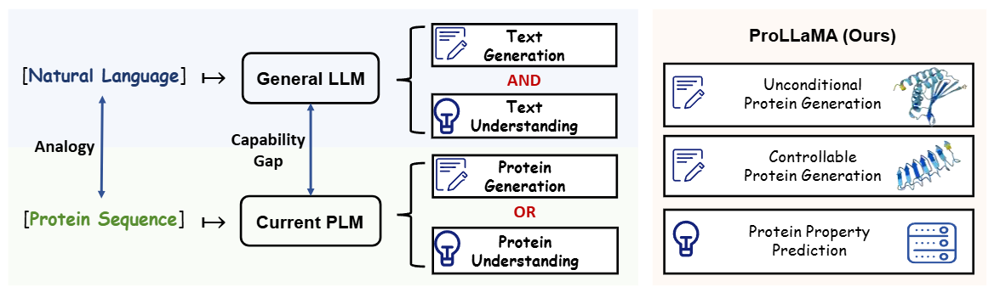
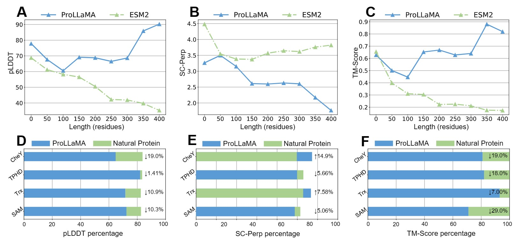
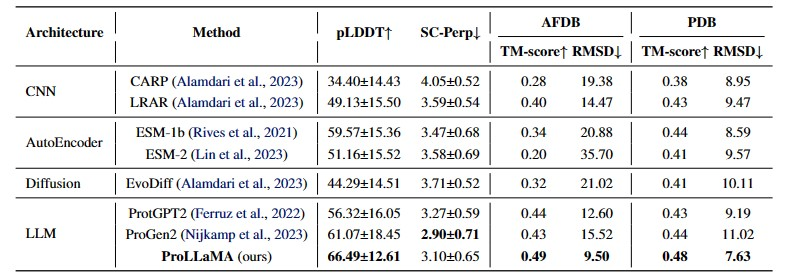
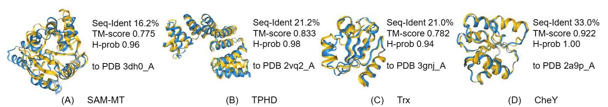
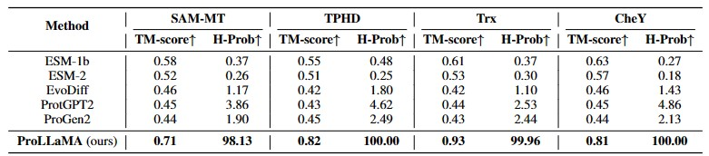
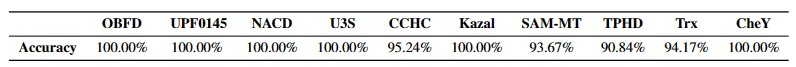
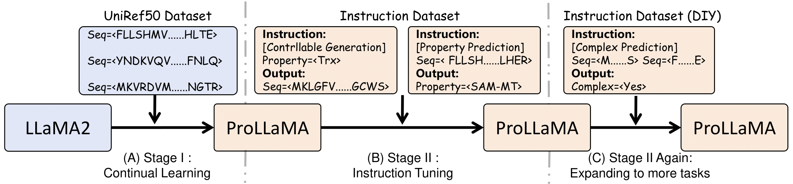

<h2 align="center"> <a href="hhttps://arxiv.org/abs/2402.16445">ProLLaMA: A Protein Large Language Model for Multi-Task Protein Language Processing</a></h2>
<h5 align="center">
    
[](https://arxiv.org/abs/2402.16445)
[](https://huggingface.co/GreatCaptainNemo/ProLLaMA)
<!-- [](https://github.com/Lyu6PosHao/ProLLaMA/blob/main/LICENSE) --> <br>

</h5>

## 📣 News
* [2.29] Update the main.py to fix bugs.
* [4.10] Add a script (in /scripts/mutation.py) to meature mutation effects.

## 🗝️ Abstract
Large Language Models (LLMs), including GPT-x and LLaMA2, have achieved remarkable performance in multiple Natural Language Processing (NLP) tasks. 
Under the premise that protein sequences constitute the protein language, Protein Large Language Models (ProLLMs) trained on protein corpora excel at de novo protein sequence generation.
However, as of now, unlike LLMs in NLP, no ProLLM is capable of multiple tasks in the **Protein Language Processing (PLP)** field.
We introduce **a training framework** to transform any general LLM into a ProLLM capable of **handling multiple PLP tasks**. Specifically, our framework utilizes low-rank adaptation and employs a two-stage training approach, and it is distinguished by its universality, low overhead, and scalability. Through training under this framework, we propose **the ProLLaMA model**, the first known ProLLM to handle multiple PLP tasks simultaneously.
Experiments show that ProLLaMA achieves state-of-the-art results in the unconditional protein sequence generation task. In the controllable protein sequence generation task, ProLLaMA can **design novel proteins with desired functionalities**. In the protein property prediction task, ProLLaMA achieves nearly 100\% accuracy across many categories. The latter two tasks are beyond the reach of other ProLLMs

<p align="center"></p>

<details open><summary> I also have other AI for Science projects that may interest you. </summary><p>
<!--  may -->

> [**TaxDiff: Taxonomic-Guided Diffusion Model for Protein Sequence Generation**](https://github.com/PKU-YuanGroup/TaxDiff) <br>
>Zongying Lin, Li Hao, Liuzhenghao Lv, Bin Lin, Junwu Zhang, Calvin Yu-Chian Chen, Li Yuan, Yonghong Tian<br>
[](https://github.com/PKU-YuanGroup/TaxDiff)  
[](https://arxiv.org/abs/2402.17156) <br>


</p ></details>

## 💡Highlights
### Powerful model
* Our ProLLaMA is the first model to our knowledge capable of simultaneously handling multiple PLP tasks.
* **including generating proteins with specified functions based on the user's intent.**

### General training framework
* We propose a training framework with scalability and efficiency that enables any general LLM to be trained as a proficient model for multiple tasks in Protein Language Processing.

### Excellent performance
* Experiments show that our ProLLaMA not only handles PLP tasks beyond the reach of existing ProLLMs but also achieves state-of-the-art results in the protein generation task where current ProLLMs are active.

## 😮Main Results
* Protein sequence generation
  <p align="center"></p>
  <p align="center"></p>
  
* Controllable protein sequence generation (controlled by the given [superfamily descriptions](https://github.com/Lyu6PosHao/ProLLaMA/blob/main/superfamilies.txt))

  ProLLaMA is capable of generating desired proteins (Blue) with functions and structures similar to natural proteins (Yellow).
  <p align="center"></p>
  <p align="center"></p>
  
* Protein property prediction
  
  <p align="center"></p>

## 🚀Pipeline
The training framework we propose is as follows:
* (A) Continual learning on protein language.
* (B) Instruction tuning on multi-tasks.
* (C) Expanding to more tasks by instruction tuning in the future.
<p align="center"></p>

## 🛠️Quick Inference
**As ProLLaMA's architecture is the same as LLaMA2, you can use ProLLaMA for inference like using LLaMA2.**

Follow the steps below to use our ProLLaMA for inference.
### 1.Install Requirements

* torch==2.0.1
* transformers==4.35.0
* cuda==11.7
```bash
git clone https://github.com/Lyu6PosHao/ProLLaMA.git
cd ProLLaMA
pip install -r requirements.txt
```

### 2.Download Model
Download from [Hugging Face](https://huggingface.co/GreatCaptainNemo/ProLLaMA)

### 3.Usage

**Just like using LLaMA2, three ways are provided here:**

* Commandline

```bash
CUDA_VISIBLE_DEVICES=0 python main.py --model "GreatCaptainNemo/ProLLaMA" --interactive
#You can replace the model_path with your local path
#Make sure you use only one GPU for inference
#Use "python main.py -h" for more details
```

* Python
```python
import torch
from transformers import AutoModelForCausalLM, AutoTokenizer,GenerationConfig
from tqdm import tqdm
device=torch.device('cuda:0')

##You can replace the file_path with your local path
tokenizer = AutoTokenizer.from_pretrained("GreatCaptainNemo/ProLLaMA", use_fast=False, trust_remote_code=True)
model = AutoModelForCausalLM.from_pretrained("GreatCaptainNemo/ProLLaMA", device_map="auto", torch_dtype=torch.bfloat16, trust_remote_code=True)
generation_config = GenerationConfig(temperature=0.2,top_k=40, top_p=0.9,do_sample=True,num_beams=1,repetition_penalty=1.2,max_new_tokens=400)
model.eval()
print("####Enter 'exit' to exit.")
with torch.no_grad():
    while True:
        messages = []
        user=str(input("Input:"))
        if user.strip()=="exit":
            break
        inputs = tokenizer(user, return_tensors="pt").to(device)
        generate_ids = model.generate(inputs.input_ids,generation_config).to(device)
        response=tokenizer.batch_decode(generate_ids, skip_special_tokens=True, clean_up_tokenization_spaces=False)[0]
        print("Output:", response)
```

* [LLaMA-Factory](https://github.com/hiyouga/LLaMA-Factory)
```bash
git clone https://github.com/hiyouga/LLaMA-Factory.git
cd LLaMA-Factory
python ./src/cli_demo.py \
      --model_name_or_path /path_to_your_model \
      --template llama2
```

### 4.Input Format
The instructions which you input to the model should follow the following format:
```text
[Generate by superfamily] Superfamily=<xxx>
or
[Determine superfamily] Seq=<yyy>
```
Here are some examples of the input:
```text
[Generate by superfamily] Superfamily=<Ankyrin repeat-containing domain superfamily>
```
```
#You can also specify the first few amino acids of the protein sequence:
[Generate by superfamily] Superfamily=<Ankyrin repeat-containing domain superfamily> Seq=<MKRVL
```
```
[Determine superfamily] Seq=<MAPGGMPREFPSFVRTLPEADLGYPALRGWVLQGERGCVLYWEAVTEVALPEHCHAECWGVVVDGRMELMVDGYTRVYTRGDLYVVPPQARHRARVFPGFRGVEHLSDPDLLPVRKR>
```
**See [this](https://github.com/Lyu6PosHao/ProLLaMA/blob/main/superfamilies.txt) on all the optional superfamilies.**

## 🛠️Qucik Train
(To Be Done) Quick usage of our training framework.

## ✒️Others
(To Be Done) The model of the first stage will also be available on Hugging Face soon.

## ✏️Citation
```BibTex
@article{lv2024prollama,
  title={ProLLaMA: A Protein Large Language Model for Multi-Task Protein Language Processing},
  author={Lv, Liuzhenghao and Lin, Zongying and Li, Hao and Liu, Yuyang and Cui, Jiaxi and Chen, Calvin Yu-Chian and Yuan, Li and Tian, Yonghong},
  journal={arXiv preprint arXiv:2402.16445},
  year={2024}
}
```
